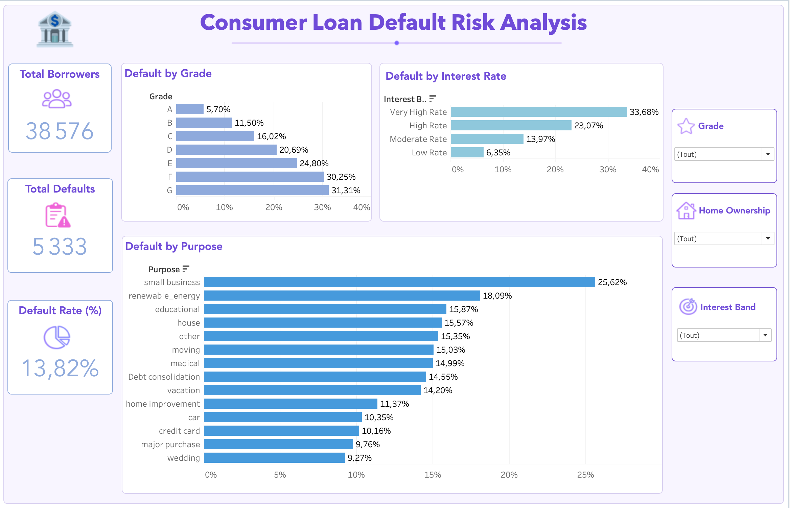

# Consumer Loan Default Risk Analysis

An interactive Tableau dashboard analyzing consumer loan default patterns across borrower grades, interest bands, loan purposes, and home ownership categories.

## Dashboard Preview



## Project Overview

This project explores the relationship between loan characteristics and default risk using interactive visual analytics.

The dashboard provides insights into:

- Total number of borrowers
- Total loan defaults
- Overall default rate
- Default rate by borrower grade
- Default rate by interest band
- Default rate by loan purpose
- Interactive filtering by grade, interest band, and home ownership status

## Data Preparation

The original dataset was cleaned and transformed before visualization:

- Removed missing and inconsistent values
- Standardized categorical variables
- Created interest rate bands (Low, Moderate, High, Very High)
- Calculated default indicators and aggregated metrics
- Prepared data for interactive Tableau analysis

## Key Insights

### Grade Risk Analysis

- Higher-grade loans (A–C) exhibit significantly lower default rates.
- Grade G borrowers present the highest risk, reaching 31.31%.

### Interest Band Analysis

- Very High Rate loans show the largest default probability (33.68%).
- Default risk increases alongside interest rates.

### Purpose Analysis

- Small business loans represent the highest default rate (25.62%).
- Educational and renewable energy loans also demonstrate elevated risks.

## Tools & Technologies

- Tableau Public
- Data Visualization
- Dashboard Design
- Interactive Filters
- Git & GitHub

## Repository Structure

```text
consumer-loan-default-risk-analysis/
│
├── README.md
├── LICENSE
├── dashboard.png
│
├── data/
│   ├── financial_loan_clean.csv
│   ├── data_understanding.ipynb
│   ├── data_cleaning.ipynb
│   └── feature_engineering.ipynb
│
├── dashboard/
│   ├── consumer_loan_dashboard.twb
│   └── dashboard.png
```

## Future Improvements

- Develop predictive default risk models using machine learning.
- Integrate Python analytics workflows with Tableau dashboards.
- Publish an interactive version through Tableau Public.
- Extend the analysis with additional borrower demographic features.

## Author
Xuan Thu Nguyen
Aspiring Financial Data Analyst
